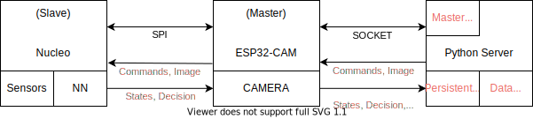

# AGV Car Project

This repo contains the resources for the AGV car project.
The goal of the project is to create a self-driving car, which uses a neural network for driving.
The project had many approaches during the semesters, this document aims to collect, describe the project for future development.
The main concept that the project uses currently is to use reinforcement learning to follow a line on the ground.
Performance is calculated from sensor input, and the car is controlled by two microcontrollers.

Sections:
* Architecture
* Microcontrollers
* * ESP
* * Nucleo
* Python Server
* Neural Networks
* Simulation
* Issues
* Future Tasks

# Dictionary
Reward - Reward is calculated based on the network's decision, and sensor input
State - State of the vehicle (position, speed, sensor data, image, decision of network, reward)

# Architecture

The system consists of three main components:
* Nucleo Controller
* ESP32-CAM Controller
* Python Server
  
The Nucleo board is responsible for handling sensor information, running the neural network and controlling the servos of the car.
It works as a Slave to the ESP32-CAM Master.
They are connected through SPI.
The ESP32-CAM is responsible for communication between the car and the Python Server.
It is also responsible for taking the image and sending the image to both sides of the communication.
The Python Server is a socket-based application, which waits for the connection of the ESP32-CAM client and sends commands and receives data gathered from the two controllers.
After gathering data, the server trains a Neural Network and sends the network to the Nucleo Controller through the ESP.
The general structure is also explained in the image below.

# Microcontollers

## ESP

ESP is the communication master.
All data flows through here between the server and Nucleo.
There are currently two versions of the code:
* ESPRESSIF VS-CODE
* Arduino IDE
  
Both of them are built similarly, but each of them was incapable of SPI communication, more on this later.
The structure of the code and workflow is that the ESP connects to the socket and sends out a request.
These requests include:
* WAITING_FOR_COMMAND - This indicates to the server that the controller is waiting for the action to perform.

Then based on the response of the server the ESP handles received actions.

Received actions can be:
* STOP - Send stop message to Nucleo and stop all tasks
* LINE_FOLLOW - Start a pre implemented line following algorithm on Nucleo
* SEND_IMAGE - Sends the image to the server
* RECEIVE_WEIGHTS - Prepare for incoming weights from the server
* USE_NETWORK - Run the network on the Nucleo, and begin data transfer between server and Nucleo (image, weights, states)
* NO_NEW_COMMAND - There has not been new input on the server, continue as before

The controller uses the camera to create images for the neural network and send them to the server.
Due to computational capacities, the image is grayscale.
The smallest available configuration is 96x96.
We could not find information about this on GitHub, but in the ESPRESSIF we get this size as a suggestion.
More information about camera configuration can be found on the [ESP32-CAM GitHub](https://github.com/espressif/esp32-camera).
Definitions and values can be found in the [header file](https://github.com/espressif/esp32-camera/blob/master/driver/include/esp_camera.h).

We have set SPI communication between the two controllers.
The table below will list the pin layout that is currently used.

| Name      | PIN |
| ----------| --- |
| MOSI      | 12  |
| MISO      | 13  |
| SCLK      | 15  |
| SS        | 14  |
| HANDSHAKE | 2   |

The handshake was used when the Nucleo was a master controller for signalling that the ESP is ready for communication.
This pin in the future can help with configuring communication between controllers, so that both of them is ready for transmit.
The library we have ended up using can be found [here](https://docs.espressif.com/projects/esp-idf/en/latest/esp32/api-reference/peripherals/spi_master.html). 

### Development

Currently, there are two alternatives to begin development with.
The first one is a C framework, [ESPRESSIF] (https://docs.espressif.com/projects/esp-idf/en/latest/esp32/index.html#).
The second is the Arduino IDE.
These projects both implement the same thing, configuring and fault detection is easier on the Arduino IDE.
To be able to connect to a Wi-Fi network it is advised to use a mobile hotspot since the local Wi-Fi's setting does not allow hosting (internet is not needed, just the network).
During development, the reset button has to be pressed on the ESP controller to begin code transfer.
This does not work all the time.
For 100% success, we have used putty to connect to the serial with a rate of 115200 and press reset.

### Arduino IDE

Code can be found [here](https://github.com/istvanaut/TK-MachineLearning/tree/main/AGVCar/Microcontrollers/ESP/ESPMasterCode).

The main difference is that this code uses a serial monitor, accessible through a browser.
This was helpful in the configuration as when the ESP is connected to the Nucleo there is no access to the serial manually.
Otherwise, packages can be installed on the Arduino faster, and there are some convenient wrappers.

For socket communication, the password and host IP can be set in the *wifi_congfig.h* file.

Issues:
* The ESP SPI.h library is limited in data transfer. We were only able to send 1 to 4 bytes of data. This is too slow to transfer the network weights
* Documentation and resources are hard to find to the ESP specific functions

### ESPRESSIF

Code can be found [here](https://github.com/istvanaut/TK-MachineLearning/tree/main/AGVCar/Microcontrollers/ESP/tcp_client).

This framework provides robust development.
It contains lots of examples and is well documented, although some of the example projects are hard to find and no longer working.

For socket communication, the password and host IP can be set in the *sdkconfig* file.

To build the project, the easiest is with the vscode built-in build function for ESP-IDF.
* Press F1 and search for build project.
* Press F1 and search for flash to UART.
* Press F1 and search for monitor.

Issues:
* Code is generally larger as there are fewer wrappers
* WebSerial is not installed
* Harder to debug
* Slow build
* Can be hard to install the framework
* If the camera init failed decrease log level to info, and increase ram to 4MB

### Tasks and issues

SPI communication is currently not working in both frameworks.
The communication should be fixed or UART should be used.
We have the communications set up correctly, there are no errors thrown, but the transaction never happens.
Documentation for the SPI communication is linked with a description of frameworks.

## NUCLEO

The Nucleo is responsible for storing sensor inputs, requesting an image from the ESP, running the neural network for decision making and spinning the servos.
Code for the Nucleo is well constructed and mostly autogenerated by the Cube IDE. Information from the Nucleo can be found [here](https://www.st.com/en/evaluation-tools/nucleo-f746zg.html).

### STM32 Cube IDE

This framework suits the board well.
Can be downloaded from [here](https://www.st.com/en/development-tools/stm32cubeide.html).
When launching the .ioc project file many configurations can be applied visually.
FreeRTOS is added as a middleware to the project.
Tasks and priorities can be set under its tab on the UI.
Most configurations use the default pins, this can be checked in the datasheet, or the UI provided by the IDE.

Look for definitions and constant values in the header files.
There is a pre implemented line following algorithm which can be found in the main.c file.
If there is an object before the front sensors, the emergency break is applied and all other functionalities are stopped.

### Issues
* The project might not detect the X-CUBE dependency. This hast to be linked manually in the IDE by opening the .ioc. Then *Pinout & Configuration>SoftwarePacks>X-CUBE-AI>simplenn* and link the *.onnx* file that can be found in the Nucleo main project root.
* C-CUBE-AI generates flags for the build that cause some build errors, such as no *__heap_malloc__ not found*. To resolve this, flags have to be deleted in the project *Properties>C/C++ Builds>Settings>MCU GCC Linker>Miscellaneous*. Remove everything, *-u_print_float* is optional. This usually happens after each code generation.
* At debug if there is no line under the car, the debug will be stuck in the light sensor task. The best way to debug is to lift the car with a wallet, so it does not roll off from the desk.
* If the light sensor does not light up reset or lift the device. 

### Tasks
* Handle master input from ESP. Communications have an example in-network.c, should be put into a separate file.
* Find a suitable location for ESP on the board, which faces the direction the vehicle is facing, and in general has an angle towards the ground.

# Python Server

The Python Server is the main hub for communication with the devices.
It starts a socket, and the ESP connects to it based on the configured parameters on the controllers.
The server waits for user input on the command line and starts communication protocols based on them.
If no user input is entered, the server sends a NO_NEW_COMMAND signal to the ESP, which continues as if nothing has happened.
The server also has persistent data storage. Information that is inserted into the **ProcessedState** class can be saved into a JSON based DataBase.

## Development
The server can be started with the *StartSocket.py* script.
Current event handlers are implemented in the **Socket** class.
The neural network is generated in the *ExportedModel* folder.
The *.onnx* file generated must match the file in the Nucleo project root.

## Tasks
* When communication between the two controllers is established, data receiving needs to be implemented based on the incoming data structure. 
* **ConnectionTrainer** is a bad wrapper for the networks, should be removed.
  
# Neural Networks
The project uses reinforcement learning.
The networks are trained with an epsilon greedy strategy.
There are a couple of networks defined in the *Networks* folder, each of them is created with the size of the image and the number of additional inputs, such as speed and acceleration.
The **ReinforcementModel** is the training model.
It loads the network and performs training.
The training data is stored in a **ReplayMemory**.
This is where data should be saved when it arrives from the ESP.
For more information about the Network, library read [here](https://github.com/istvanaut/TK-MachineLearning/blob/main/AGVCar/Documentation/NeuralNetworkDocument.pdf). 

# Simulaton
In the first semester of the project, a simulation environment was created in Carla to pretrain the network.
The network performed well in the simulation, but we could not try them on the vehicle as it was misconfigured.
In the future training in Carla could provide the starting weights for the network.

# Contact
For more information or issues not contained in this description write to the following people:

Dániel Turóczy: Teams or e-mail: turoczyd6@gmail.com

